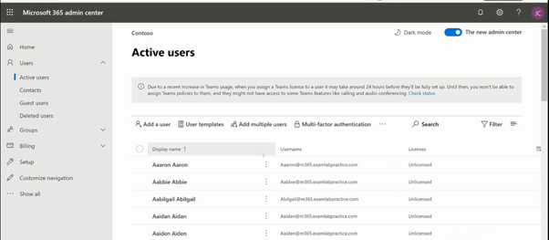
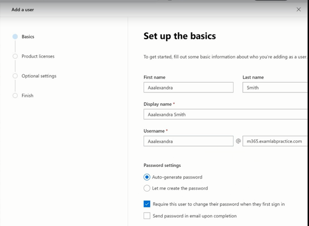
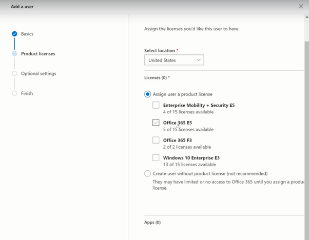
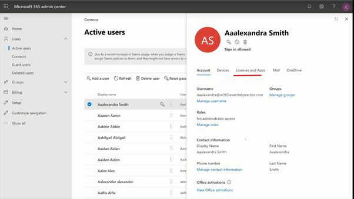

# User-identity-administration
Creating User Identity and assign the EMS license.

<h2>Description</h2>
Project consists of a creating a new user and assigning a required license to him/her. 
<br />


<h2>Environments Used </h2>

- <b>Microsoft 365 Admin Center Portal</b> 

<h2>Prerequisites</h2>

-<b> Identity Protection policy can be created or modified by anyone assigned the following roles:
 - License administrator
 - User administrator
 - Global Administrator
 </b>
- <b> Licenses: Azure AD Free or Premium P1 or Premium P2</b>


<h2>Program walk-through:</h2>

<h3>Steps: </h3>

1. Go to Microsoft 365 admin portal 
2.	From Menu , select ‘Users’ -> Active users
3.	Click ‘+add user’
4.	Give name, username, First name, Last name, Password, location
5.	Next --> 
6.	Select license EMS
7.	Next --> Finish


<h3>Screenshots:</h3>

<p align="center">
All users: <br/>

<br />
<br />
Create a User: <br/>

<br />
<br />
Assign a license: <br/>

<br />
<br />
Result: <br/>

<br />
<br />


</p>

<!--
 ```diff
- text in red
+ text in green
! text in orange
# text in gray
@@ text in purple (and bold)@@
```
--!>
